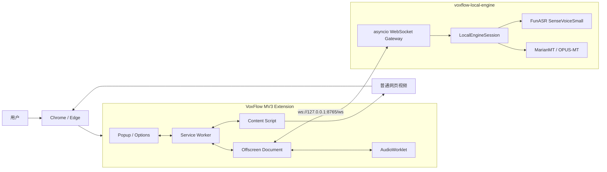
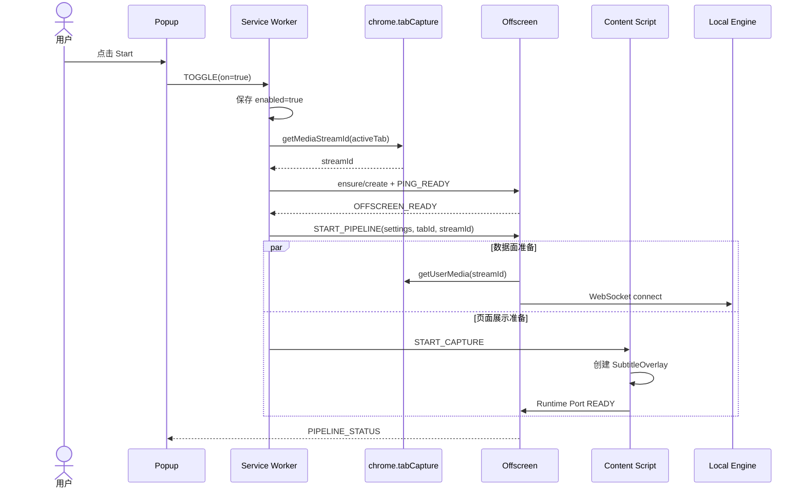
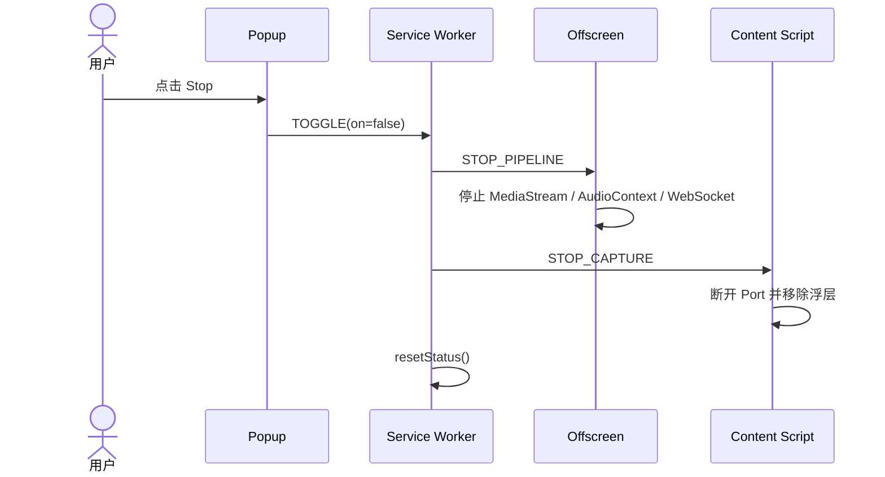
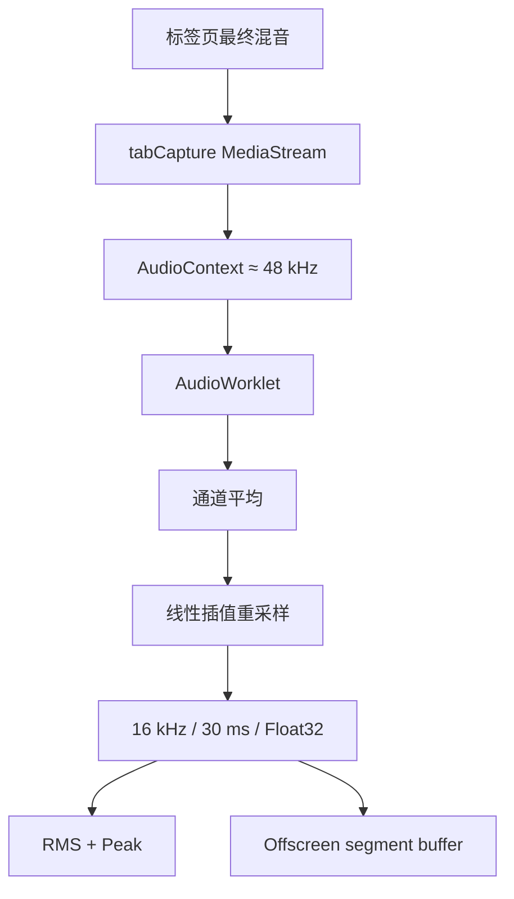
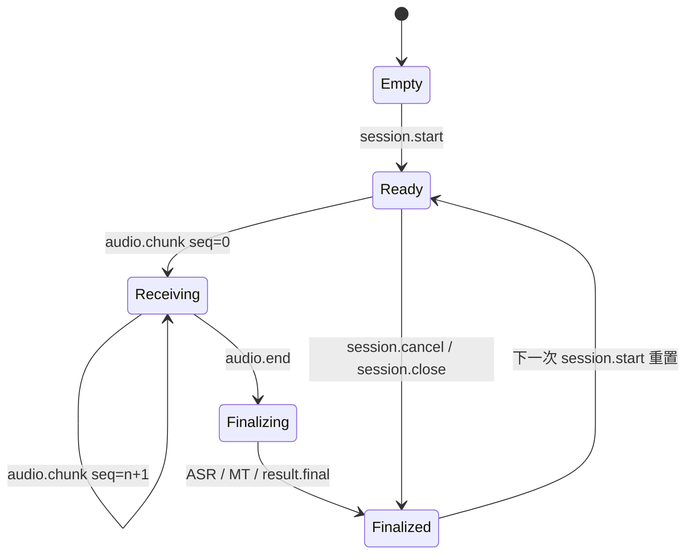
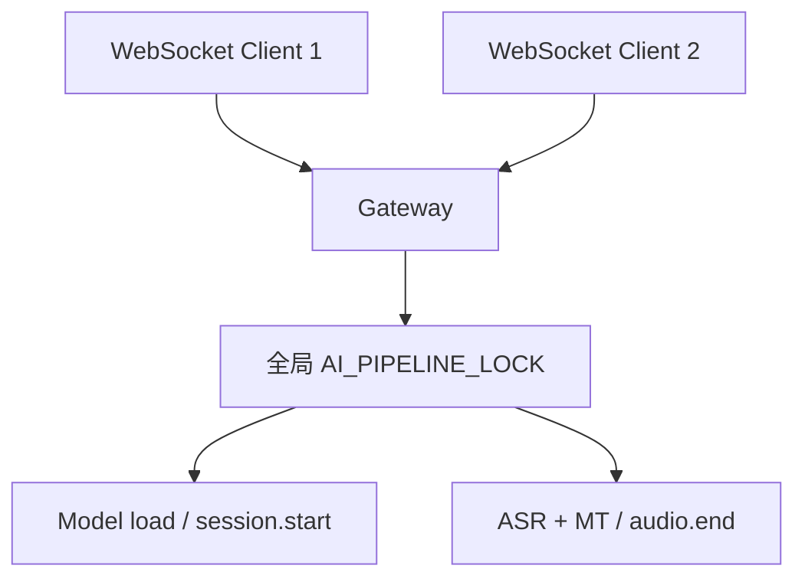
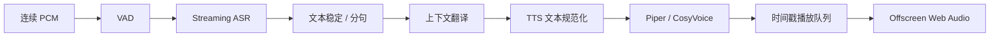

# VoxFlow 架构说明

> 最后更新：2026-07-29
>
> 适用版本：`0.1.0` 当前工作树
>
> 文档性质：当前实现基线 + 明确标注的演进设计

VoxFlow 是一个本地优先的网页视频语音翻译系统，由 Chrome / Edge Manifest V3 扩展和 Python 本地 AI 服务组成。

当前已跑通的主链路是：

```text
chrome.tabCapture
  → Offscreen AudioWorklet
  → 16 kHz mono Float32 PCM
  → 静音感知的 1.2～7 秒分段
  → WebSocket voxflow.local.v1
  → FunASR SenseVoiceSmall
  → MarianMT English-to-Chinese
  → 网页双语文本浮层
```

当前已实现浏览器侧能量/静音启发式分段，但尚未实现模型 VAD、增量 ASR、TTS、译文音频播放和音画同步。本文会严格区分：

- **当前实现**：代码已经进入实际运行路径。
- **骨架 / 预留**：已有类型、目录或空实现，但没有进入产品链路。
- **目标设计**：后续建议，不应被理解为现有能力。

## 阅读导航

- [产品边界与实现状态](#1-产品目标与边界)：第 1～2 节
- [系统上下文与仓库结构](#3-系统上下文)：第 3～4 节
- [浏览器扩展、时序与音频路径](#5-浏览器扩展架构)：第 5～7 节
- [本地服务、协议与状态](#8-本地-ai-服务架构)：第 8～10 节
- [模型、安全、性能与目标管线](#11-模型与文件布局)：第 11～14 节
- [测试、架构决策与演进](#15-测试与验证)：第 15～19 节

## 1. 产品目标与边界

### 1.1 产品目标

VoxFlow 希望最终提供以下体验：

1. 捕获网页中正在播放的视频声音。
2. 在本机完成源语言语音识别。
3. 在本机完成目标语言文本翻译。
4. 在本机生成目标语言语音。
5. 用译文语音替代原声，并维持可接受的音画同步。
6. 默认不上传原始音频、识别文本和翻译文本。

首个稳定语向为：

```text
English speech → English text → Simplified Chinese text
```

### 1.2 当前非目标

- 不支持 Netflix、Disney+ 等 DRM / Widevine 强保护内容。
- 不承诺任意网站都能捕获音频。
- 不支持多用户或多租户推理服务。
- 不提供云端托管、账号、计费或远程 API。
- 当前不提供实时中文配音。
- 当前不追求口型级同步。
- Firefox 构建脚本存在，但主音频链路依赖 Chromium `chrome.tabCapture`。

## 2. 实现状态总览

| 子系统 | 状态 | 说明 |
|---|---|---|
| WXT / React / TypeScript 扩展 | 已实现 | 根目录统一构建，没有独立的 `apps/extension/package.json` |
| Manifest V3 Service Worker | 已实现 | 管理开关、标签页、Offscreen 与状态路由 |
| `chrome.tabCapture` | 已实现 | 当前唯一产品主捕获路径 |
| Offscreen Document | 已实现 | 承载捕获 AudioContext、WebSocket 和分段 |
| AudioWorklet 降采样 | 已实现 | 48 kHz 左右输入转 16 kHz mono，30 ms 一帧 |
| Content Script 字幕浮层 | 已实现 | 显示原文、译文和运行提示 |
| 静音感知分段 | 已实现 | 240 ms pre-roll、450 ms 句尾静音、1.2 秒最短、7 秒强制切段 |
| 本地 WebSocket 网关 | 已实现 | Python `asyncio` 标准库实现 |
| `voxflow.local.v1` | 已实现 | JSON 文本帧承载 Base64 PCM |
| FunASR ASR | 已实现 | SenseVoiceSmall，整段临时 WAV 推理 |
| MarianMT 英译中 | 已实现 | Transformers + PyTorch，本地模型 |
| 服务断线重连 | 已实现 | Offscreen 每 2 秒重试 |
| 模型 VAD | 骨架 | 当前能量启发式不是 FSMN-VAD / Silero；`vad_segmenter.py` 仍占位 |
| ASR partial / streaming | 协议预留 | 当前服务只产生 `asr.final` |
| TTS | 骨架 | Piper / CosyVoice 文件为空实现，请求会失败 |
| 音频播放与同步 | 骨架 | Player / Scheduler / Lag Manager 未接入 |
| 共享 protocol package | 已实现 | 本地引擎协议类型集中在 `packages/protocol`，扩展只保留兼容导出 |
| 共享 audio package | 已实现基础工具 | PCM16 转换、线性重采样和 PCM16 WAV 编解码可用 |
| 健康检查与模型校验 | 已实现 | `/health` 返回能力、模型文件和冷/热加载状态 |
| 网关 Origin / Token 校验 | 已实现基础能力 | 默认限制扩展 Origin；Token 可选，尚未自动生成 |
| Docker / 安装脚本 | 骨架 | `infra` 目录暂无可部署实现 |

## 3. 系统上下文



核心边界：

- 浏览器扩展负责权限、媒体捕获、交互、状态与展示。
- 本地服务负责模型生命周期、音频校验、ASR 和翻译。
- 两侧只通过版本化 WebSocket 协议耦合。
- 模型文件不打包进扩展，避免 Manifest V3、CSP、内存和包体限制。

## 4. 仓库结构与代码所有权

```text
voxflow/
├── apps/
│   ├── extension/
│   │   └── src/
│   │       ├── entrypoints/
│   │       │   ├── background.ts
│   │       │   ├── content.ts
│   │       │   ├── offscreen/main.ts
│   │       │   ├── popup/
│   │       │   └── options/
│   │       ├── core/
│   │       │   ├── audio/
│   │       │   ├── engine/
│   │       │   ├── playback/
│   │       │   └── subtitles/
│   │       ├── messaging/
│   │       ├── store/
│   │       └── public/
│   ├── local-ai-server/
│   │   ├── src/
│   │   │   ├── main.py
│   │   │   ├── config.py
│   │   │   ├── ws/
│   │   │   ├── providers/
│   │   │   ├── pipeline/
│   │   │   └── utils/
│   │   ├── scripts/
│   │   └── tests/
│   └── models/mt/               # Git LFS 跟踪的 MT fallback
├── models/                      # 用户下载的本地模型，默认忽略
├── packages/
│   ├── protocol/
│   └── audio/
├── docs/
├── infra/
├── package.json
└── wxt.config.ts
```

### 4.1 当前事实来源

| 主题 | 当前事实来源 |
|---|---|
| 扩展 Manifest 与构建输出 | `wxt.config.ts` |
| 扩展设置与默认值 | `apps/extension/src/core/types.ts` |
| 扩展内部消息 | `apps/extension/src/messaging/protocol.ts` |
| 扩展与客户端使用的服务协议类型 | `packages/protocol/src/local-engine.ts` |
| 服务端协议行为 | `apps/local-ai-server/src/ws/session.py` |
| 完整协议说明 | `docs/local-engine-protocol.md` |
| 本地模型默认路径 | `apps/local-ai-server/src/config.py` |

`apps/extension/src/core/engine/local-engine-protocol.ts` 只作为历史导入路径的兼容导出；协议类型的单一事实来源已经收敛到 `packages/protocol/src/local-engine.ts`。服务端仍以 Python 实现协议解析，因此协议变更必须同步检查共享类型、服务端解析、终端客户端和协议文档。

## 5. 浏览器扩展架构

### 5.1 Manifest 与权限

扩展由根目录 WXT 工程构建：

```text
srcDir: apps/extension/src
outDir: dist/extension
```

当前权限：

| 权限 | 用途 |
|---|---|
| `offscreen` | 创建持久媒体宿主 |
| `storage` | 保存设置 |
| `scripting` | 必要时补注入 Content Script |
| `activeTab` | 操作当前活动标签页 |
| `tabCapture` | 获取标签页音频 stream ID |

Host permissions 当前包含 `<all_urls>` 及 `127.0.0.1:8765` / `localhost:8765` 的 HTTP、WebSocket 地址。

### 5.2 Service Worker

文件：`apps/extension/src/entrypoints/background.ts`

职责：

- 接收 Popup 的 `TOGGLE`。
- 通过 `chrome.storage.local` 持久化 `enabled`。
- 查询当前活动标签页。
- 调用 `chrome.tabCapture.getMediaStreamId` 获取一次性 stream ID。
- 创建或复用 Offscreen Document，并执行 ready/ping 握手。
- 向 Offscreen 发送 `START_PIPELINE` / `STOP_PIPELINE`。
- 向 Content Script 发送 `START_CAPTURE` / `STOP_CAPTURE`。
- Content Script 不存在时通过 `chrome.scripting.executeScript` 补注入。
- 保存当前内存状态并向 Popup 广播。

Service Worker 不处理 PCM、不加载模型，也不持有 WebSocket。这符合 MV3 Service Worker 会被回收的运行特性。

### 5.3 Offscreen Document

文件：`apps/extension/src/entrypoints/offscreen/main.ts`

Offscreen 是当前浏览器侧数据面的核心：

- 使用 stream ID 调用 `navigator.mediaDevices.getUserMedia`。
- 创建 `AudioContext`、MediaStreamSource 和 AudioWorkletNode。
- 收取 30 ms Float32 PCM 帧。
- 统计 chunks、bytes、duration、RMS、Peak。
- 保留 240 ms pre-roll，并在句尾静音或 7 秒上限时成段。
- 先调用 `/health` 检查模型文件、能力与安全配置。
- 连接本地 WebSocket 服务。
- 将每段拆成 200 ms `audio.chunk`。
- 接收 ASR / MT 结果。
- 把双语文本通过运行时 Port 发给 Content Script。
- WebSocket 断开后每 2 秒重连。

Offscreen 使用静音 GainNode 连接到 `ctx.destination`，确保 AudioWorklet 持续被拉取，但不把捕获到的原声重新播放出来。

### 5.4 AudioWorklet

运行文件：`apps/extension/src/public/voxflow-pcm-capture.worklet.js`

加载辅助：`apps/extension/src/core/audio/pcm-capture.worklet.ts`

当前处理：

1. 对输入通道求平均，得到 mono。
2. 使用线性插值从实际 AudioContext 采样率重采样到 16 kHz。
3. 每 480 samples 生成一帧，即 30 ms。
4. 计算该帧 RMS 与 Peak。
5. 通过 transferable `ArrayBuffer` 发送给 Offscreen 主线程。

输出固定为：

```text
sampleRate: 16000 Hz
channels: 1
sampleFormat: Float32 / f32le
frameSize: 480 samples
frameDuration: 30 ms
```

当前 Worklet 使用跨 render quantum 的线性重采样状态和固定 `Float32Array` 输出帧，不再使用普通数组、`push` 或 `splice`。每凑够 480 samples 才分配并 transfer 一个结果 buffer。

### 5.5 Content Script

文件：`apps/extension/src/entrypoints/content.ts`

当前职责：

- 在 `<all_urls>`、`document_idle` 注入。
- 创建和更新 `SubtitleOverlay`。
- 建立名为 `voxflow:session` 的 Runtime Port。
- 每 250 ms读取页面首个 `<video>` 的 `currentTime`、暂停状态和倍速。
- 接收 Offscreen 发来的 `SUBTITLE`。

PCM 不经过 Content Script；它直接在 Offscreen 内产生和处理。`voxflow:session` Port 只承载 ready、视频时间和字幕消息，旧 `PCM` 消息类型已经移除。

Content Script 上报的 `VIDEO_TIME` 当前在 Offscreen 中被接收但丢弃，尚未进入 `media.state` 或播放同步逻辑。

### 5.6 Popup、Options 与存储

Popup：

- 切换 Start / Stop。
- 显示运行状态。
- 显示 chunks、bytes、音频时长、RMS、Peak 和采样率。
- 显示错误。

Options 当前只开放：

- Local engine URL。
- 可选 Local engine token。
- 英文源语言。
- 简体中文目标语言。

`Settings` 中还定义了 provider、延迟模式、播放缓冲、丢弃阈值和字幕选项，但多数尚未暴露或进入有效运行逻辑。

设置保存在：

```text
chrome.storage.local["voxflow:settings"]
```

运行状态当前只保存在 Service Worker 内存中。Service Worker 被回收后，状态可能重置；这也是未来需要做状态恢复的原因。

## 6. 启动与停止时序

### 6.1 Start



注意：当前实现先向 Offscreen 启动管线，再让 Content Script 创建浮层。即使 Content Script 注入失败，Offscreen 仍可能已经开始采集。

### 6.2 Stop



Offscreen Document 本身不会在每次 Stop 时关闭，只停止内部资源，供后续快速复用。

## 7. 音频数据路径

### 7.1 浏览器内采集



分段常量位于 `core/audio/silence-segmenter.ts`，传输常量位于 Offscreen：

| 常量 | 当前值 | 含义 |
|---|---:|---|
| `MIN_SEGMENT_MS` | 1200 ms | 最短可提交段 |
| `trailingSilenceMs` | 450 ms | 检测到句尾静音后提交 |
| `preRollMs` | 240 ms | 语音开始前保留的上下文 |
| `maxSegmentMs` | 7000 ms | 连续语音强制切段上限 |
| `MAX_BUFFER_MS` | 12000 ms | 引擎离线/繁忙时的音频保留上限 |
| `ENGINE_CHUNK_MS` | 200 ms | 向服务端发送的协议分包大小 |
| `ENGINE_RECONNECT_MS` | 2000 ms | WebSocket 重连周期 |

当前用自适应噪声底限、RMS/Peak 和句尾静音做浏览器侧启发式分段；无语音时只保留 pre-roll，正常句子可早于 7 秒提交，连续声音在 7 秒强制切段。它能降低固定等待，但不是模型 VAD，音乐/噪声环境仍可能误判。30 ms Worklet 帧和 200 ms 传输包也不等于流式 ASR，因为服务端仍只在收到 `audio.end` 后开始整段推理。

### 7.2 传输编码

扩展会：

1. 合并当前静音感知语音段的 Float32Array。
2. 按 200 ms 切片。
3. 直接读取小端 Float32 的字节视图。
4. Base64 编码。
5. 放进 JSON `audio.data`。
6. 以 WebSocket text frame 发送。

标称音频数据率：

```text
16000 samples/s × 4 bytes = 64 KB/s raw PCM
Base64 后约 85 KB/s，不含 JSON envelope
```

当前协议简单易调试，但编码、内存复制和 JSON 解析开销较高。二进制 WebSocket 帧是明确的后续优化方向。

### 7.3 原声行为

`tabCapture` 取得标签页音频后，当前只连接到增益为 0 的输出，因此原声不会继续外放。这符合未来“译文语音替代原声”的方向，但在 TTS 尚未实现的当前版本中，Start 后用户只会看到双语文本。

## 8. 本地 AI 服务架构

### 8.1 进程入口与配置

入口：

```bash
python -m src.main --host 127.0.0.1 --port 8765
```

默认配置：

| 项目 | 默认值 |
|---|---|
| Host | `127.0.0.1` |
| Port | `8765` |
| WebSocket Path | `/ws` |
| ASR Model | `models/asr/SenseVoiceSmall` |
| ASR Language | `en` |
| MT Model | `models/mt`，不存在则 `apps/models/mt` |

### 8.2 WebSocket Gateway

文件：`apps/local-ai-server/src/ws/gateway.py`

网关使用 Python 标准库实现：

- `asyncio.start_server` 接收 TCP 连接。
- 手工处理 HTTP Upgrade。
- 接收 masked WebSocket text frame。
- 每个 TCP / WebSocket 连接创建一个 `LocalEngineSession`。
- 最大 WebSocket frame 为 2 MiB。
- 校验浏览器 Origin，并在配置 Token 时同时保护 `/health` 与 `/ws`。
- 拒绝未 masked、分片和带扩展位的客户端帧，支持 ping/pong 控制帧。
- 未实现扩展帧、压缩和完整 RFC 边界能力。
- 所有 AI 启动与 finalize 任务通过全局 `AI_PIPELINE_LOCK` 串行。
- 阻塞模型调用通过 `asyncio.to_thread` 移出事件循环。

这是适合 MVP 的最小实现，不适合作为公网或多租户网关。

### 8.3 Session 生命周期

文件：`apps/local-ai-server/src/ws/session.py`

每个连接当前只维护一个可重置的 `LocalEngineSession`：



服务端验证：

- 协议版本必须为 `voxflow.local.v1`。
- `asr` 是 MT / TTS 的前置阶段。
- 当前 MT 只接受英文源语言与简体中文目标语言。
- 当前只接受单声道。
- 同一 session 不能改变 sample rate、channels 或 sample format。
- chunk `seq` 必须从 0 连续递增。
- `audio.end` 的 stream ID 和 `lastSeq` 必须与接收状态一致。
- 单个解码后 chunk 最大 1 MiB。
- 单 session 最长 120 秒。
- 支持 `f32le` 和 `pcm16le` 输入，内部归一为 `f32le`。

扩展当前为每个静音感知语音段创建新的 `sessionId`，在同一 WebSocket 连接上依次执行 `session.start → audio.chunk* → audio.end`。

### 8.4 ASR Provider

文件：`apps/local-ai-server/src/providers/asr/funasr_engine.py`

当前流程：

1. `session.start` 根据 model、language、device 取得 FunASR engine。
2. Engine 以 `(model, language, device)` 为键进行进程内缓存。
3. `audio.end` 时把内存中的 f32le 转成 PCM16。
4. 写入临时 WAV。
5. 调用 `AutoModel.generate`。
6. 清理 SenseVoice 输出中的 `<|...|>` 标记。
7. 在 `finally` 中删除临时 WAV。

当前默认 `device="cpu"`。虽然协议允许 `cuda` 和 `mps`，扩展 UI 没有设备选择，服务也没有自动设备探测。

当前 `merge_vad=True` 只作为 FunASR generate 参数传入；没有显式加载 `vad_model`，也没有实现持续流式 VAD 分段。因此不能把它视为已经接入 FSMN-VAD。

### 8.5 Translation Pipeline

文件：`apps/local-ai-server/src/pipeline/translation_pipeline.py`

当前使用：

- `MarianTokenizer`
- `MarianMTModel`
- PyTorch `inference_mode`
- `Helsinki-NLP/opus-mt-en-zh` 本地目录

模型在首次翻译时惰性加载，并以进程级单例缓存。翻译调用使用线程锁保护。

MT 当前只实现 `huggingface` provider。Session 会明确拒绝 `argos`、`libretranslate` 和 `ctranslate2`，不再静默回退到 MarianMT。`argos_engine.py` 只是兼容导出，LibreTranslate 与 CTranslate2 仍是占位文件。

### 8.6 当前并发模型



`audio.chunk` 的 Base64 解码与缓冲不经过 AI 锁；模型加载和 finalize 经过全局锁。这可以降低当前模型线程安全风险，但多个客户端会互相等待，且没有队列深度、超时或取消正在执行推理的能力。

## 9. `voxflow.local.v1` 协议

默认端点：

```text
ws://127.0.0.1:8765/ws
```

### 9.1 客户端消息

| 类型 | 当前用途 |
|---|---|
| `session.start` | 声明 stages、模型参数与输入音频格式 |
| `audio.chunk` | 发送连续 Base64 PCM 包 |
| `audio.end` | 完成当前段并触发 ASR / MT |
| `media.state` | 协议支持，服务当前忽略 |
| `session.cancel` | 清空当前缓冲并停止 |
| `session.close` | 当前等价于 cancel |

### 9.2 服务端事件

| 类型 | 当前状态 |
|---|---|
| `session.started` | 已实现 |
| `engine.status` | 已实现 |
| `audio.stats` | 已实现，约每 1 秒聚合一次，并在段结束时补发 |
| `asr.final` | 已实现 |
| `mt.final` | 已实现 |
| `result.final(kind=asr/text)` | 已实现 |
| `tts.audio` / `tts.final` | 类型预留，当前不产生 |
| `error` | 已实现 |

### 9.3 管线行为

| `pipeline.stages` | 结果 |
|---|---|
| `["asr"]` | `asr.final` + `result.final(kind=asr)` |
| `["asr", "mt"]` | `asr.final` + `mt.final` + `result.final(kind=text)` |
| 包含 `tts` | 非恢复错误 `tts_unavailable` |

完整 envelope、字段、校验和示例参见 [docs/local-engine-protocol.md](docs/local-engine-protocol.md)。

## 10. 内部消息与状态流

### 10.1 控制消息

`apps/extension/src/messaging/protocol.ts` 定义：

```text
TOGGLE
GET_STATUS
GET_SETTINGS
UPDATE_SETTINGS
REQUEST_CAPTURE
START_PIPELINE
STOP_PIPELINE
PING_READY
OFFSCREEN_READY
PIPELINE_STATUS
STATUS
```

控制消息经 `chrome.runtime.sendMessage` 传递。异步错误被包装为 `__voxflowError`，调用端再恢复为 Error。

### 10.2 Runtime Port

Content Script 和 Offscreen 使用长连接 Port：

```text
name: voxflow:session
messages: READY / VIDEO_TIME / SUBTITLE / END
```

当前主路径使用 `READY`、`VIDEO_TIME` 和 `SUBTITLE`；`END` 保留为页面侧停止通知。

### 10.3 状态机

运行状态类型：

```text
idle
checking-engine
engine-offline
loading-models
ready
capturing
streaming
playing
paused
error
```

当前实际常见路径：

```text
idle → checking-engine → capturing / ready → streaming
                         ↘ engine-offline
                         ↘ error
streaming → idle
```

`loading-models` 已接入服务端模型加载状态；`playing` 和 `paused` 仍没有完整状态转移。

## 11. 模型与文件布局

### 11.1 ASR

默认路径：

```text
models/asr/SenseVoiceSmall/
├── config.yaml
├── model.pt
└── ...
```

`models/**` 默认被 `.gitignore` 忽略，只保留 `.gitkeep`。ASR 模型需要用户下载，不进入 Git。

### 11.2 MT

优先路径：

```text
models/mt
```

回退路径：

```text
apps/models/mt
```

`apps/models/mt` 的大权重由 Git LFS 跟踪。当前运行只需要 PyTorch 权重与 tokenizer / config 文件，TensorFlow、Flax 和 Rust 权重不参与推理。

### 11.3 TTS

预留路径：

```text
models/tts
```

当前没有模型下载器、provider 实现或运行时加载。

## 12. 隐私与安全

### 12.1 当前已做到

- 服务默认绑定 `127.0.0.1`，并拒绝非 loopback host。
- 扩展默认连接 `ws://127.0.0.1:8765/ws`。
- 推理完成后不保存长期音频文件。
- ASR 临时 WAV 在 `finally` 中删除。
- 模型准备完成后，ASR / MT 推理不要求云端 API。
- 默认没有云端 API Key。

### 12.2 当前缺口

| 项目 | 当前状态 | 风险 |
|---|---|---|
| Token 校验 | 已实现、默认未启用 | 需通过环境变量/启动参数与扩展 Options 配置同一 Token |
| Origin 校验 | 已实现基础白名单 | 默认允许浏览器扩展 scheme；建议生产安装配置精确扩展 Origin |
| TLS | 未实现 | 只适合回环地址 |
| 健康检查 | 已实现 `/health` | 返回模型文件、冷/部分/热加载状态和能力 |
| 能力协商 | 已实现基础能力清单 | 尚未协商协议降级或动态 provider 参数 |
| 请求速率限制 | 未实现 | 本地端口可能被滥用 |
| 结构化日志与脱敏 | 未实现 | 当前主要使用 print / 异常消息 |

因此必须保持默认回环绑定。当前版本不应直接绑定 `0.0.0.0`，也不应暴露到公网。

### 12.3 建议的安全演进顺序

1. 将默认扩展 scheme 白名单收紧为已安装扩展的精确 Origin。
2. 首次启动生成并安全持久化本地随机 token。
3. 扩展与服务自动交换/保存 token，避免手工配置。
4. 在现有 `/health` 能力清单上增加协议降级协商。
5. 增加连接数、消息大小、速率和 session 时长限制。
6. 仅在明确的远程部署模式下引入 TLS。

## 13. 性能与延迟

### 13.1 当前延迟组成

```text
首条译文延迟
≈ 句尾静音等待或 7 秒强制切段
 + ASR 冷启动 / 热推理
 + MT 冷启动 / 热推理
 + 协议和 UI 开销
```

当前最大结构性延迟仍是“等待语音段结束 + 整段 ASR”，而不是 localhost WebSocket。

### 13.2 当前性能瓶颈

- 静音启发式仍可能在噪声/音乐中等到 7 秒上限，且服务只做整段 ASR。
- Float32 + Base64 + JSON 增加约 33% 编码体积。
- ASR 每段写临时 WAV。
- AI 全局锁将所有客户端串行化。
- MT 使用通用 Transformers / PyTorch，尚未量化或转换 CTranslate2。
- 冷启动没有显式预热。

### 13.3 优化优先级

1. 用服务端模型 VAD 替换浏览器能量启发式。
2. 流式或增量 ASR，产生 `asr.partial`。
3. 在现有 readiness / capabilities 上增加模型预热。
4. ~~Worklet 固定缓冲与更少复制。~~ 已完成基础优化。
5. 二进制 WebSocket 帧。
6. ~~`audio.stats` 聚合采样。~~ 已按约 1 秒聚合。
7. 直接 waveform 推理，避免临时 WAV。
8. MarianMT → CTranslate2 / 量化。
9. 显式任务队列、取消和背压。
10. TTS 首包流式返回与浏览器播放调度。

更完整的分析见 [docs/performance-optimization.md](docs/performance-optimization.md)。

## 14. TTS 与同步目标设计

本节是目标设计，不是当前能力。

### 14.1 目标管线



### 14.2 时间戳

未来每个 TTS 音频包需要携带：

```text
segmentId
sourceStartMs
sourceEndMs
audio duration
sequence number
```

Content Script 上报的 `video.currentTime` 应转换为 `media.state` 送入本地服务或交给 Offscreen Scheduler。播放队列根据当前媒体时间计算 lag。

### 14.3 背压

必须避免直播场景越看越落后：

- 队列 lag 超过阈值时进入追赶状态。
- 优先丢弃过旧或低价值片段。
- 必要时只保留最新完整句。
- 在自然静音间隙追赶。
- UI 显示 lag、queue depth 和丢弃事件。

现有 `playbackBufferMs=2000`、`lagDropMs=5000` 只是设置预留，当前没有执行这些策略。

## 15. 测试与验证

### 15.1 当前自动检查

TypeScript：

```bash
npm run compile
npm test
npm run build
```

Python Session 单元测试：

```bash
cd apps/local-ai-server
.venv/bin/python -m unittest discover -s tests -v
```

自动测试当前覆盖：

- 扩展控制消息、Tab 消息与 Session Port 的运行时判别。
- 静音 pre-roll、句尾切段和 7 秒强制切段。
- 共享 PCM、重采样与 WAV 工具。
- ASR + MT final 事件。
- 音频 seq 顺序校验。
- `audio.end` stream / lastSeq 校验。
- 空音频错误。
- FunASR 加载失败。
- TTS 未实现时的明确错误。
- Origin / Token 校验和 WebSocket frame 边界。
- 模型文件与 Git LFS pointer 完整性检查。

### 15.2 终端端到端验证

```bash
cd apps/local-ai-server
.venv/bin/python scripts/realtime_client.py \
  --wav tmp/hello.wav \
  --stages asr,mt
```

这个客户端验证真实 WebSocket 握手、模型加载、音频分包、ASR、MT 和 final 事件。

### 15.3 当前测试缺口

- 扩展测试当前只覆盖纯消息边界，没有 Chrome API mock。
- 没有浏览器 E2E。
- 没有网关协议模糊测试。
- 没有多连接并发测试。
- 没有性能基准与冷 / 热启动指标。
- 没有跨平台安装验证矩阵。
- 没有 DRM / 非 DRM 网站兼容性矩阵。

## 16. 架构决策

### ADR-001：模型运行在本地 Python 服务

选择：

- 扩展只做浏览器能力。
- ASR / MT / TTS 放在本地服务。

原因：

- Python 模型生态成熟。
- 避免 MV3 CSP、Service Worker 生命周期与扩展内存限制。
- 模型下载、缓存、GPU 和日志更容易管理。

代价：

- 用户需要安装 Python 环境并启动伴随服务。
- 需要维护浏览器与服务之间的版本协议。

### ADR-002：使用 `chrome.tabCapture` 作为主捕获路径

原因：

- 捕获标签页最终音频。
- 避免页面已经调用 `createMediaElementSource` 的冲突。
- 对复杂播放器比 DOM media element 接管更稳健。

代价：

- Chromium 特有。
- 需要用户手势和活动标签页。
- 当前接管后原声不再外放。
- DRM 内容仍不支持。

`core/audio/audio-capture.ts` 中保留的 MediaElementSource 捕获实现当前不在主路径。

### ADR-003：Offscreen 承载浏览器数据面

原因：

- Service Worker 不适合 Web Audio 和长连接。
- Content Script 随页面生命周期变化。
- Offscreen 能持有 AudioContext、WebSocket 与后续播放器。

代价：

- 增加跨执行环境消息与生命周期协调。
- 状态恢复更复杂。

### ADR-004：MVP 使用 JSON + Base64

原因：

- 协议可读、可记录、终端客户端易实现。
- 先验证端到端语义。

代价：

- 体积与 CPU 开销较高。
- 后续需要迁移二进制帧并设计兼容策略。

### ADR-005：MVP 使用标准库 WebSocket 网关

原因：

- 避免额外 Web 框架依赖。
- 足以支撑单机协议验证。

代价：

- RFC 完整性、速率限制和可观测性仍有限。
- 产品化时可能迁移到成熟 WebSocket / ASGI 实现。

## 17. 已知技术债

按影响排序：

1. 能量启发式分段在噪声/音乐中可能误判，且整段 ASR 仍限制首条延迟。
2. TTS 与播放完全未接入，但类型和设置容易让人误以为可用。
3. `media.state` 和 `VIDEO_TIME` 尚未接通。
4. Service Worker 内存状态不能可靠跨回收恢复。
5. Token 仍需手工配置，Origin 默认规则尚未绑定精确扩展 ID。
6. 健康检查能区分模型文件与加载状态，但尚未执行模型预热。
7. Base64 音频路径仍有多份复制。
8. VAD、TTS、sync、infra 中仍存在大量占位文件。
9. 根目录缺少 CI、跨平台安装脚本和浏览器 E2E。

## 18. 演进路线

### P0：稳定当前文本链路

- [x] 统一协议单一事实来源。
- [x] 增加扩展消息和 Session 测试。
- [x] 明确 readiness、错误码和冷启动状态。
- [x] 增加模型完整性检查与 ASR / MT 下载脚本。
- [x] 完成本地可选 Token 和 Origin 校验基础能力。
- [ ] 自动生成/分发 Token，并把 Origin 收紧到精确扩展 ID。

### P1：降低首条字幕延迟

- 接入服务端模型 VAD。
- [x] 先用静音感知启发式替代固定 7 秒提交。
- 支持 `asr.partial`。
- [x] 聚合 stats，减少协议噪声。
- 建立延迟指标基线。

### P2：优化本地推理

- 避免临时 WAV。
- 引入 CTranslate2 或量化 MT。
- 增加 CPU / CUDA / MPS 设备选择。
- 实现模型预热与能力协商。
- 将 WebSocket 音频迁移为二进制帧。

### P3：实现译文语音

- 接入 Piper 轻量 TTS。
- 评估 CosyVoice 高质量档位。
- 实现 `tts.audio` / `tts.final`。
- Offscreen AudioPlayer 播放服务端音频。

### P4：同步与产品化

- 接通 `VIDEO_TIME → media.state`。
- 实现 PlaybackScheduler 与 LagManager。
- 增加背压、追赶和丢弃策略。
- 一键安装、模型管理和桌面伴随服务。
- 建立 Chrome / Edge 与网站兼容矩阵。

## 19. 变更架构时的检查清单

修改扩展与服务边界时，至少检查：

- `apps/extension/src/core/engine/local-engine-protocol.ts`
- `packages/protocol/src/local-engine.ts`
- `apps/local-ai-server/src/ws/session.py`
- `apps/local-ai-server/scripts/realtime_client.py`
- `apps/local-ai-server/tests/test_session.py`
- `docs/local-engine-protocol.md`
- 本文档与 `README.md`

修改音频格式时，额外检查：

- AudioWorklet 输出格式。
- Offscreen 分段和 `encodeF32leBase64`。
- `Session.normalize_audio_payload`。
- sample rate、channels、frameCount 和 byteLength 校验。
- 测试 WAV 与终端客户端。

修改捕获生命周期时，额外检查：

- 用户手势是否仍满足 `tabCapture` 要求。
- Offscreen 是否 ready。
- Start / Stop 是否释放 MediaStream track、AudioContext、Port 和 WebSocket。
- Content Script 重复注入保护。
- Service Worker 回收后的恢复行为。

---

当前架构的核心判断是：**浏览器扩展负责“拿到媒体并呈现体验”，本地服务负责“运行 AI”，版本化协议负责隔离两者。** 下一阶段的关键不是继续堆叠模型名称，而是先把固定分段升级为可观测、可背压的流式管线，再接入 TTS 与同步播放。
