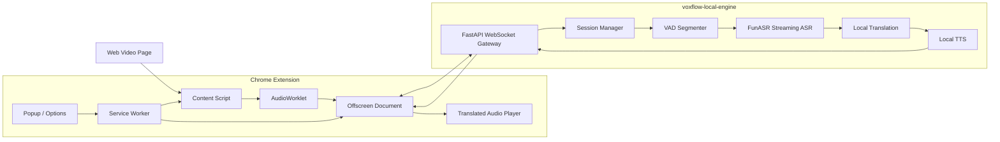
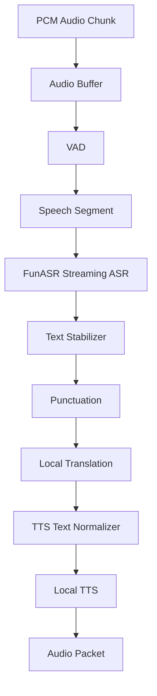

# VoxFlow 架构设计方案

> 本文档是 VoxFlow 的架构设计基线。
>
> 当前路线：Chrome 扩展负责捕获网页视频音频、静音原声、播放译文音频；本地 AI 服务负责 ASR、翻译与 TTS。核心原则是免费开源、可本地部署、隐私优先、低延迟同传。

---

## 1. 产品目标

VoxFlow 是一款可在 Chrome/Edge 浏览器中使用的实时视频声音翻译扩展。

目标能力：

1. 捕获网页中正在播放的视频声音。
2. 将源语言语音识别为文本，例如英文语音转英文文本。
3. 将源语言文本翻译为目标语言文本，例如英文文本转中文文本。
4. 将目标语言文本合成为目标语言语音，例如中文文本转中文语音。
5. 自动静音网页原声，只播放翻译后的语音。
6. 尽量让译文语音与视频画面保持可接受同步。

产品定位：

- 不是单纯字幕翻译工具，字幕只是辅助展示。
- 核心体验是“实时同传配音”。
- 不追求零延迟口型级对齐，优先实现低延迟、可持续、可本地部署的实时翻译声音。
- 默认首个语向为 `English -> Chinese`，架构上支持扩展到更多语种。

---

## 2. 总体路线

最终采用路线为：拆分式本地 AI 管线。

```text
网页视频音频
  -> Chrome Extension 音频捕获
  -> 本地 AI 服务 FunASR 语音识别
  -> 本地翻译引擎
  -> 本地 TTS 引擎
  -> Chrome Extension 播放译文音频
```

与纯云端方案相比：

- 不上传用户音频，隐私更好。
- 不依赖第三方 API Key。
- 长期使用成本更低。
- 可根据机器性能选择不同模型档位。

与浏览器内直接跑大模型相比：

- 更稳定，不受 MV3 扩展沙箱、CSP、WebAssembly/WebGPU 限制过多影响。
- 更适合 FunASR、CosyVoice、Piper、CTranslate2 等 Python/本地推理生态。
- 更容易做模型下载、GPU 加速、日志、性能监控和后续桌面端封装。

---

## 3. 核心技术选型

| 层级 | 选型 | 说明 |
|---|---|---|
| 浏览器扩展 | Chrome Manifest V3 | Chrome/Edge 主流扩展标准 |
| 扩展语言 | TypeScript | 强类型约束消息协议、状态机、音频管线 |
| 扩展构建 | WXT 或 Vite + CRX 插件 | 当前工程已有 WXT 基础，可继续使用 |
| 扩展 UI | React + TypeScript | popup/options/状态面板 |
| 音频捕获 | Web Audio API + AudioWorklet | 从网页 video 捕获 PCM，降采样分帧 |
| 扩展持久媒体宿主 | Offscreen Document | MV3 下承载 WebSocket、Web Audio 播放、管线状态 |
| 扩展后台 | Service Worker | 轻量调度、offscreen 生命周期、状态路由 |
| 本地服务语言 | Python 3.10+ | 适配 FunASR、TTS、翻译模型生态 |
| 本地服务框架 | FastAPI + WebSocket | 低延迟音频流通信 |
| ASR | FunASR | 阿里开源，可本地部署，支持实时/离线识别 |
| VAD | FunASR FSMN-VAD 或 Silero VAD | 用于语音边界检测和低延迟分段 |
| 标点 | FunASR punctuation model | 提升翻译与 TTS 可读性 |
| 翻译 | Argos Translate / LibreTranslate / CTranslate2 | 优先免费开源、可本地部署 |
| TTS | CosyVoice / Piper | 优先本地语音合成；Piper 作为轻量 fallback |
| 音频播放 | Web Audio API | 播放本地服务返回的 PCM/WAV/Opus 音频 |

---

## 4. 系统架构



### 4.1 Chrome Extension 职责

扩展只做浏览器侧能力，不直接运行大模型。

职责：

- 捕获当前网页视频音频。
- 静音网页原声。
- 将 PCM 音频流发送给本地 AI 服务。
- 接收 ASR/翻译/TTS 结果。
- 播放目标语言音频。
- 显示双语字幕、状态、延迟、错误提示。
- 管理用户设置，例如源语言、目标语言、本地服务地址、延迟模式。

### 4.2 Local AI Engine 职责

本地服务承担全部 AI 计算。

职责：

- WebSocket 接收扩展发送的音频帧。
- 对音频做 VAD、分段、缓冲、时间戳管理。
- 调用 FunASR 完成实时语音识别。
- 调用本地翻译引擎完成文本翻译。
- 调用本地 TTS 引擎生成目标语言音频。
- 将 partial ASR、final ASR、翻译文本、TTS 音频返回扩展。
- 做性能监控、模型加载、错误恢复和资源释放。

---

## 5. Chrome MV3 执行环境设计

| 执行环境 | 能力限制 | 主要职责 |
|---|---|---|
| Service Worker | 无 DOM、易被回收 | 开关状态、offscreen 生命周期、content script 注入、状态广播 |
| Content Script | 运行在网页上下文附近，随页面销毁 | video 发现、音频接管、原声静音、字幕浮层 |
| Offscreen Document | 有 DOM/Web Audio，可较持久运行 | WebSocket、本地服务通信、译文音频播放、状态桥接 |
| AudioWorklet | 实时音频线程 | 混音、重采样、分帧、输出 PCM |
| Popup/Options | 用户界面 | 开关、设置、状态展示、错误提示 |

关键原则：

- Service Worker 只做轻量调度，不处理音频与 AI。
- Content Script 只做页面相关工作，不运行重模型。
- Offscreen Document 是浏览器侧“媒体管线宿主”。
- 大模型全部下沉到 `voxflow-local-engine`。

---

## 6. 音频捕获与静音方案

### 6.1 主路径：Web Audio 接管 video

在 Content Script 中找到页面主视频元素，使用 Web Audio 接管视频音频：

```ts
const ctx = new AudioContext({ sampleRate: 48000, latencyHint: 'interactive' });
const source = ctx.createMediaElementSource(video);
const worklet = new AudioWorkletNode(ctx, 'voxflow-pcm-capture');
const sink = ctx.createMediaStreamDestination();

source.connect(worklet);
worklet.connect(sink);
// 不连接 ctx.destination，因此原视频声音不会外放。
```

效果：

- 音频进入 Web Audio 图。
- AudioWorklet 可以拿到 PCM。
- 因为不连接扬声器输出，原声被静音。
- 不需要设置 `video.muted = true`，避免静音后采集到的也是静音。

AudioWorklet 输出格式：

```text
sampleRate: 16000 Hz
channels: mono
sampleFormat: Float32 或 PCM16
chunkSize: 20ms - 100ms，建议 MVP 使用 30ms 或 60ms
```

### 6.2 兜底路径：chrome.tabCapture

当 Web Audio 接管失败时，例如：

- 跨域直链视频导致 CORS 污染。
- 页面已有其他脚本调用过 `createMediaElementSource`。
- 特殊播放器无法通过 `<video>` 稳定接管。

可回退到 `chrome.tabCapture` 捕获标签页音频。

注意：

- `tabCapture` 更接近捕获标签页最终输出混音。
- 用户授权和 Chrome 权限要求更严格。
- 需要实测不同网站行为。
- DRM/受保护内容不作为支持目标。

### 6.3 不支持范围

- Netflix、Disney+ 等 DRM/Widevine 强保护内容。
- 浏览器或网站条款禁止捕获的内容。
- 非标准播放器中无法获取音频的场景。

---

## 7. 本地 AI 管线设计



### 7.1 VAD

推荐顺序：

1. FunASR 自带 FSMN-VAD。
2. Silero VAD 作为替代或实验选项。
3. 能量法仅作为 debug fallback，不作为正式质量方案。

VAD 输出事件：

```text
speech-start
speech-frame
speech-end
```

用途：

- 减少静音段送入 ASR 的计算浪费。
- 形成更自然的话语边界。
- 在 `speech-end` 时触发 ASR flush。
- 在静音间隙让 TTS 队列追赶。

### 7.2 ASR：FunASR

FunASR 是主 ASR 引擎。

第一版目标：

- 支持英文视频转中文。
- 支持 16kHz mono PCM 输入。
- 支持流式或近实时识别。
- 支持 partial/final 区分。
- 支持按话语边界 flush。

推荐模型策略：

| 场景 | 推荐方向 |
|---|---|
| 低延迟 MVP | FunASR streaming Paraformer / SenseVoiceSmall |
| 多语言扩展 | SenseVoiceSmall / Fun-ASR-Nano / Qwen-ASR 系列按需评估 |
| CPU 机器 | 小模型、量化、较大 chunk、允许更高延迟 |
| GPU 机器 | 更高质量模型、更短延迟、更好准确率 |

ASR 输出：

```json
{
  "type": "asr.final",
  "text": "hello everyone welcome to this video",
  "startMs": 1200,
  "endMs": 3600
}
```

### 7.3 文本稳定与分句

实时 ASR 会产生变化中的 partial 文本。设计规则：

- partial 文本只用于字幕预览。
- final 文本才进入翻译和 TTS。
- 对过短、明显不完整的片段做延迟合并。
- 在句号、逗号、停顿、VAD speech-end 时提交翻译。
- 不等待整段长句结束，优先低延迟。

### 7.4 翻译

优先本地开源方案。

MVP 推荐：

- Argos Translate：部署简单，适合快速验证。
- LibreTranslate：可作为本地 HTTP 翻译服务，但需注意许可证。

产品化推荐：

- CTranslate2 + OPUS-MT / NLLB。
- 支持量化、CPU/GPU 推理、性能更可控。

翻译策略：

- 按 ASR final segment 增量翻译。
- 保留上下文窗口，例如最近 2-5 个 segment，提高指代和术语一致性。
- 翻译输出进入 TTS 前做简单文本规范化。

### 7.5 TTS

优先本地 TTS。

推荐组合：

| TTS | 用途 | 特点 |
|---|---|---|
| CosyVoice | 高质量中文/多语言语音 | 音质更好，资源占用更高 |
| Piper | 轻量 fallback | CPU 友好，部署简单 |
| 系统 TTS/chrome.tts | 应急 fallback | 简单但排程和音频控制较弱 |

正式路线：

- 本地服务生成音频数据。
- 扩展 Offscreen Document 通过 Web Audio 播放。
- 不优先使用 `speechSynthesis` 作为主 TTS，因为它难以精确控制音频 buffer 和播放排程。

---

## 8. 同步与延迟策略

实时翻译声音一定存在延迟。VoxFlow 的目标不是零延迟，而是“稳定、可理解、尽量低延迟”。

### 8.1 延迟目标

| 阶段 | MVP 目标 |
|---|---:|
| 音频采集与传输 | 30-150ms |
| VAD 分段 | 50-300ms |
| FunASR partial | 300-1000ms |
| ASR final | 800-2000ms |
| 翻译 | 50-500ms |
| TTS 首包 | 300-1500ms |
| 播放缓冲 | 300-1000ms |
| 端到端 | 2-5s |

### 8.2 两种工作模式

| 模式 | 说明 | 适用场景 |
|---|---|---|
| 低延迟模式 | 视频不暂停，译文语音略落后 | 直播、访谈、短视频 |
| 同步优先模式 | 启动时建立 2-4 秒缓冲，必要时轻微调节播放 | 课程、长视频、录播 |

### 8.3 播放调度

每个译文音频片段需要携带源时间戳：

```json
{
  "type": "tts.audio",
  "seq": 12,
  "sourceStartMs": 1200,
  "sourceEndMs": 3600,
  "audioStartMs": 0,
  "durationMs": 1800
}
```

Offscreen Document 维护播放队列：

- 按 `sourceStartMs` 排序。
- 与当前 `video.currentTime` 计算 lag。
- lag 过小时等待。
- lag 过大时加速、跳过低价值片段或丢弃过期片段。
- speech-end 静音间隙优先排空队列。

### 8.4 背压策略

必须避免直播越看越落后。

规则：

- 队列累计延迟超过阈值，例如 4-6 秒，触发背压。
- 优先丢弃短语气词、重复片段、过旧片段。
- 必要时只保留最新完整句。
- UI 显示“正在追赶实时”。

---

## 9. 通信协议

### 9.1 扩展内部消息

扩展内部继续使用类型化消息协议。

```ts
type ControlMessage =
  | { kind: 'TOGGLE'; on: boolean }
  | { kind: 'GET_STATUS' }
  | { kind: 'UPDATE_SETTINGS'; patch: Partial<Settings> }
  | { kind: 'START_PIPELINE'; settings: Settings }
  | { kind: 'STOP_PIPELINE' }
  | { kind: 'PIPELINE_STATUS'; status: RuntimeStatus };

type PcmPortMessage =
  | { kind: 'PCM'; samples: ArrayBuffer; sampleRate: number; ts: number }
  | { kind: 'VIDEO_TIME'; current: number }
  | { kind: 'SUBTITLE'; payload: SubtitlePayload }
  | { kind: 'END' };
```

### 9.2 扩展到本地服务 WebSocket

连接地址默认：

```text
ws://127.0.0.1:8765/ws
```

客户端到服务端：

```ts
type LocalEngineClientMessage =
  | {
      type: 'session.start';
      sessionId: string;
      sourceLang: string;
      targetLang: string;
      sampleRate: 16000;
      asrProvider: 'funasr';
      mtProvider: 'argos' | 'libretranslate' | 'ctranslate2';
      ttsProvider: 'cosyvoice' | 'piper';
    }
  | {
      type: 'audio.chunk';
      sessionId: string;
      seq: number;
      timestampMs: number;
      sampleRate: 16000;
      format: 'f32le' | 'pcm16';
      audio: ArrayBuffer;
    }
  | {
      type: 'media.state';
      sessionId: string;
      currentTime: number;
      paused: boolean;
      playbackRate: number;
    }
  | {
      type: 'session.stop';
      sessionId: string;
    };
```

服务端到客户端：

```ts
type LocalEngineServerMessage =
  | {
      type: 'engine.status';
      sessionId: string;
      state: 'loading' | 'ready' | 'running' | 'error';
      message?: string;
    }
  | {
      type: 'asr.partial';
      sessionId: string;
      text: string;
      startMs?: number;
      endMs?: number;
    }
  | {
      type: 'asr.final';
      sessionId: string;
      text: string;
      startMs: number;
      endMs: number;
    }
  | {
      type: 'translation.final';
      sessionId: string;
      sourceText: string;
      translatedText: string;
      sourceStartMs: number;
      sourceEndMs: number;
    }
  | {
      type: 'tts.audio';
      sessionId: string;
      seq: number;
      text: string;
      audioFormat: 'pcm16' | 'wav' | 'opus';
      sampleRate: number;
      sourceStartMs: number;
      sourceEndMs: number;
      audio: ArrayBuffer;
    }
  | {
      type: 'error';
      sessionId: string;
      code: string;
      message: string;
    };
```

---

## 10. 安全与隐私

### 10.1 本地服务安全

本地服务必须：

- 默认只监听 `127.0.0.1`。
- 不监听 `0.0.0.0`，除非用户显式开启局域网模式。
- 首次启动生成本地 token。
- 扩展连接 WebSocket 时必须携带 token。
- 支持 CORS/Origin 检查，只允许 VoxFlow 扩展来源。
- 默认不保存原始音频。
- debug 音频落盘必须由用户显式开启。

### 10.2 模型与数据

- 模型文件保存在本地用户目录或项目指定目录。
- 不上传音频、识别文本、翻译文本。
- 日志默认不记录完整音频内容。
- 错误日志可记录模型名、延迟、状态，但应避免泄露用户观看内容。

---

## 11. 工程目录设计

最终推荐目录：

```text
voxflow/
├── apps/
│   ├── extension/
│   │   ├── src/
│   │   │   ├── entrypoints/
│   │   │   │   ├── background.ts
│   │   │   │   ├── content.ts
│   │   │   │   ├── offscreen/
│   │   │   │   ├── popup/
│   │   │   │   └── options/
│   │   │   ├── core/
│   │   │   │   ├── audio/
│   │   │   │   │   ├── audio-capture.ts
│   │   │   │   │   ├── pcm-capture.worklet.ts
│   │   │   │   │   └── resampler.ts
│   │   │   │   ├── engine/
│   │   │   │   │   ├── local-engine-client.ts
│   │   │   │   │   └── local-engine-protocol.ts
│   │   │   │   ├── playback/
│   │   │   │   │   ├── audio-player.ts
│   │   │   │   │   ├── playback-scheduler.ts
│   │   │   │   │   └── lag-manager.ts
│   │   │   │   └── subtitles/
│   │   │   │       └── subtitle-overlay.ts
│   │   │   ├── messaging/
│   │   │   │   ├── protocol.ts
│   │   │   │   └── bridge.ts
│   │   │   ├── store/
│   │   │   │   ├── settings.ts
│   │   │   │   └── state.ts
│   │   │   └── lib/
│   │   ├── package.json
│   │   └── wxt.config.ts
│   └── local-ai-server/
│       ├── src/
│       │   ├── main.py
│       │   ├── config.py
│       │   ├── ws/
│       │   │   ├── gateway.py
│       │   │   └── session.py
│       │   ├── pipeline/
│       │   │   ├── audio_buffer.py
│       │   │   ├── vad_segmenter.py
│       │   │   ├── asr_pipeline.py
│       │   │   ├── translation_pipeline.py
│       │   │   ├── tts_pipeline.py
│       │   │   └── sync_metadata.py
│       │   ├── providers/
│       │   │   ├── asr/
│       │   │   │   └── funasr_engine.py
│       │   │   ├── mt/
│       │   │   │   ├── argos_engine.py
│       │   │   │   ├── libretranslate_engine.py
│       │   │   │   └── ctranslate2_engine.py
│       │   │   └── tts/
│       │   │       ├── cosyvoice_engine.py
│       │   │       └── piper_engine.py
│       │   └── utils/
│       │       ├── audio.py
│       │       ├── logging.py
│       │       └── timestamps.py
│       ├── pyproject.toml
│       └── README.md
├── packages/
│   ├── protocol/
│   │   └── src/
│   │       ├── extension.ts
│   │       └── local-engine.ts
│   └── audio/
│       └── src/
│           ├── pcm.ts
│           ├── wav.ts
│           └── resample.ts
├── models/
│   ├── asr/
│   ├── mt/
│   └── tts/
├── docs/
│   ├── architecture.md
│   ├── local-deployment.md
│   ├── model-selection.md
│   ├── latency-budget.md
│   └── privacy.md
├── infra/
│   ├── docker/
│   └── scripts/
├── ARCHITECTURE.md
└── README.md
```

---

## 12. 设置项设计

```ts
interface Settings {
  enabled: boolean;
  localEngineUrl: string;      // 默认 ws://127.0.0.1:8765/ws
  localEngineToken?: string;
  sourceLang: string;          // 默认 en
  targetLang: string;          // 默认 zh
  asrProvider: 'funasr';
  mtProvider: 'argos' | 'libretranslate' | 'ctranslate2';
  ttsProvider: 'cosyvoice' | 'piper';
  latencyMode: 'low-latency' | 'sync-first';
  playbackBufferMs: number;    // 默认 1500-3000
  lagDropMs: number;           // 默认 4000-6000
  showSubtitles: boolean;
  showOriginalText: boolean;
  debugLogging: boolean;
}
```

---

## 13. 运行状态设计

```ts
interface RuntimeStatus {
  state:
    | 'idle'
    | 'checking-engine'
    | 'engine-offline'
    | 'loading-models'
    | 'ready'
    | 'capturing'
    | 'streaming'
    | 'playing'
    | 'paused'
    | 'error';
  engineConnected: boolean;
  currentTabId?: number;
  sourceLang: string;
  targetLang: string;
  lagMs: number;
  queueDepth: number;
  asrText?: string;
  translatedText?: string;
  error?: string;
}
```

---

## 14. 开发路线图

### P0：架构迁移

目标：把当前工程从“浏览器内 AI 推理”调整为“扩展 + 本地 AI 服务”。

验收：

- `ARCHITECTURE.md` 更新为本文档路线。
- 新增 `local-ai-server` 骨架。
- 新增扩展到本地服务的协议定义。
- 移除或隔离旧 Whisper/opus-mt 浏览器内推理主路径。

### P1：扩展音频捕获

目标：扩展能稳定捕获网页视频 PCM。

验收：

- YouTube/Bilibili 普通视频可捕获音频。
- 原声可静音或不外放。
- Offscreen 能收到连续 16kHz mono PCM。
- 页面显示基础字幕浮层。

### P2：本地服务连通

目标：扩展与本地服务通过 WebSocket 通信。

验收：

- 本地服务启动后 popup 显示 connected。
- 扩展能发送音频 chunk。
- 本地服务能回传测试文本和测试音频。
- Offscreen 能播放服务返回的测试音频。

### P3：FunASR 实时识别

目标：接入 FunASR。

验收：

- 英文视频可实时输出 ASR partial/final。
- 字幕浮层显示英文识别文本。
- VAD 能正确切分话语。

### P4：本地翻译

目标：接入 Argos 或 CTranslate2。

验收：

- ASR final 自动翻译为中文。
- 字幕浮层显示中英双语。
- 翻译延迟可观测。

### P5：本地 TTS 与播放同步

目标：接入 CosyVoice/Piper，并由扩展播放目标语言音频。

验收：

- 原视频静音。
- 能听到中文译文语音。
- 端到端延迟控制在 2-5 秒内。
- 队列过长时能背压丢弃旧段。

### P6：产品化

目标：提升稳定性与可用性。

验收：

- 模型下载/检测流程可视化。
- 本地服务 token 鉴权。
- 多语言配置。
- 自动重连。
- 错误提示清晰。
- 支持常见视频网站。

---

## 15. 风险与限制

1. 实时同传无法做到零延迟，必须接受 2-5 秒左右落后。
2. FunASR、本地翻译、TTS 的语言覆盖并不完全一致，“任意语言”需要逐个模型支持。
3. 本地部署对用户机器性能有要求，CPU 模式延迟更高。
4. DRM 视频和受保护内容不支持。
5. 网页播放器差异很大，`createMediaElementSource` 不一定在所有网站可用。
6. TTS 音频长度可能与原语音长度差异较大，需要语速调整和背压策略。
7. 本地服务要处理模型下载、显存不足、进程崩溃、端口占用等问题。
8. 若未来发布到 Chrome Web Store，需要清晰说明音频捕获、隐私与本地处理逻辑。

---

## 16. 当前工程可继承资产

当前工程中值得保留或迁移的设计：

- WXT + TypeScript + React 的扩展工程基础。
- `background/content/offscreen/popup/options` 的入口划分。
- Service Worker 管理 offscreen 生命周期的方式。
- `PING_READY/OFFSCREEN_READY` 形式的 offscreen 就绪握手。
- Content Script 中通过 Web Audio 接管 `<video>` 的音频捕获方式。
- AudioWorklet 中 48kHz 到 16kHz 的实时降采样思路。
- 类型化消息协议与 bridge 封装。
- 设置存储与运行状态缓存。
- 字幕 overlay 基础实现。
- TTS 队列、lag、背压这些同步控制思想。

需要替换或下线的部分：

- 浏览器内 Whisper 推理主路径。
- 浏览器内 opus-mt 推理主路径。
- WebGPU/ONNX Runtime Web 作为主 AI 推理路径。
- `speechSynthesis` 作为主 TTS 播放路径。
- 当前 worker stub 逻辑。

---

## 17. 推荐 MVP 组合

第一版建议收敛为：

```text
Extension:
  WXT + TypeScript + React + MV3
  Content Script + AudioWorklet 捕获 16k mono PCM
  Offscreen WebSocket 连接本地服务
  Web Audio 播放本地 TTS 音频

Local AI Engine:
  Python + FastAPI + WebSocket
  ASR: FunASR
  VAD: FunASR FSMN-VAD
  MT: Argos Translate
  TTS: Piper 或 CosyVoice

Target:
  English video -> Chinese voice
  Non-DRM websites first
  2-5s end-to-end latency
```

该组合优先保证可运行、免费、本地、隐私安全。后续再扩展多语种、高质量 TTS、CTranslate2/NLLB、GPU 加速和桌面 companion app。
