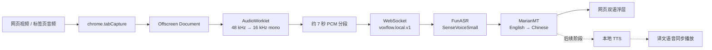

# VoxFlow

<p align="center">
  <strong>让网页视频跨过语言边界，不让音频离开你的电脑</strong><br>
  VoxFlow 在 Chrome / Edge 中捕获视频声音，并在本机完成语音识别与翻译。<br>
  无需云端语音 API，无需第三方 API Key，默认不上传音频。
</p>

<p align="center">
  <a href="https://github.com/xiaohao-1337/voxflow/stargazers"></a>
  
  
  
  
  
</p>

<p align="center">
  <a href="#快速开始">快速开始</a> ·
  <a href="#首次使用">首次使用</a> ·
  <a href="#工作原理">工作原理</a> ·
  <a href="#故障排查">故障排查</a> ·
  <a href="#路线图">路线图</a>
</p>

---

VoxFlow 是一个本地优先的网页视频语音翻译项目。浏览器扩展负责捕获标签页音频与展示双语文本，本地 AI 服务负责 FunASR 语音识别和 MarianMT 机器翻译。项目的最终目标，是提供一套可本地部署、低成本、隐私友好的网页视频实时同传配音方案。

> [!IMPORTANT]
> 当前版本已经跑通 **网页音频捕获 → 英文语音识别 → 简体中文翻译 → 网页双语浮层**。当前采用约 7 秒音频分段，属于近实时文本翻译；VAD、真正的流式 ASR、TTS 中文语音与音画同步播放仍在开发中。

如果你也希望看外语课程、访谈、直播和短视频时，不必把音频交给云端服务，欢迎点一个 [Star](https://github.com/xiaohao-1337/voxflow/stargazers)。每一个 Star 都会让这个方向被更多本地 AI 和无障碍技术爱好者看到。

## 为什么选择 VoxFlow

- **隐私留在本机**：扩展默认只连接 `127.0.0.1`，音频在浏览器和本地服务之间传输。
- **不按调用次数付费**：ASR 和翻译模型均可本地运行，不需要购买云端额度。
- **真正面向网页视频**：通过 `chrome.tabCapture` 捕获标签页最终音频，而不是依赖网站字幕。
- **浏览器与模型解耦**：扩展保持轻量，FunASR、翻译模型和未来的 TTS 都运行在 Python 服务中。
- **协议可组合**：`voxflow.local.v1` 支持 `ASR`、`ASR + MT`，并为 `ASR + MT + TTS` 保留扩展空间。
- **过程可观察**：弹窗可查看连接状态、音频分片、采样率、RMS 与 Peak，便于定位采集问题。

## 当前能力

| 能力 | 状态 | 当前实现 |
|---|---|---|
| Chrome / Edge Manifest V3 扩展 | ✅ 已实现 | WXT + React + TypeScript |
| 标签页音频捕获 | ✅ 已实现 | `chrome.tabCapture` + Offscreen Document |
| 实时降采样 | ✅ 已实现 | AudioWorklet 输出 16 kHz、单声道、Float32 PCM |
| 本地英文 ASR | ✅ 已实现 | FunASR `SenseVoiceSmall`，整段推理 |
| 英译简中 | ✅ 已实现 | Hugging Face MarianMT / `Helsinki-NLP/opus-mt-en-zh` |
| 网页双语浮层 | ✅ 已实现 | 展示英文识别结果和中文译文 |
| 本地 WebSocket 协议 | ✅ 已实现 | `voxflow.local.v1`，JSON + Base64 PCM |
| 服务断线重连 | ✅ 已实现 | 扩展每 2 秒尝试重连 |
| VAD / 增量 ASR | 🚧 规划中 | 当前固定约 7 秒成段 |
| 中文 TTS | 🚧 规划中 | 请求 TTS 时明确返回 `tts_unavailable` |
| 译文语音同步播放 | 🚧 规划中 | 播放、时间戳、队列文件目前为骨架 |

一次真实的终端验证输出如下：

```text
[ASR final] The tribal chieftain called for the boy and presented him with 50 pieces of gold.
[MT final] 部落酋长呼唤男孩,并交给他50块黄金。
```

## 工作原理



浏览器侧采用 Manifest V3 的多执行环境协作：

- Service Worker 管理开关、活动标签页、`tabCapture` stream ID 与 Offscreen 生命周期。
- Offscreen Document 持有 AudioContext、AudioWorklet、本地 WebSocket 和分段状态。
- Content Script 维护网页字幕浮层，并上报视频播放时间。
- Popup 展示状态与采集指标，Options 保存本地服务地址和语向设置。

本地服务使用 Python `asyncio` 实现轻量 WebSocket 网关。每段音频先由 SenseVoiceSmall 识别，再由 MarianMT 翻译，最终通过同一连接返回 `asr.final`、`mt.final` 和 `result.final`。

完整设计参见 [ARCHITECTURE.md](ARCHITECTURE.md)，协议字段参见 [docs/local-engine-protocol.md](docs/local-engine-protocol.md)。

## 快速开始

下面的步骤以 macOS / Linux 为主，Windows PowerShell 的差异命令见对应提示。建议第一次严格按顺序完成：**克隆 → 安装依赖 → 下载模型 → 终端验证 → 构建扩展 → 浏览器测试**。

### 0. 环境要求

| 软件 / 资源 | 最低要求 | 推荐 |
|---|---|---|
| Chrome / Edge | 116+ | 最新稳定版 |
| Node.js | 20.19+ | Node.js 22 LTS |
| npm | 随 Node.js 安装 | 使用仓库锁定文件执行 `npm ci` |
| Python | 3.10+ | Python 3.11 |
| Git LFS | 3.x | 最新稳定版 |
| 内存 | 8 GB | 16 GB 或更多 |
| 可用磁盘 | 约 5 GB | 8 GB 或更多，便于保留依赖缓存 |
| GPU | 不要求 | 当前默认仍使用 CPU |

确认本机版本：

```bash
node --version
npm --version
python3.11 --version
git lfs version
```

> [!NOTE]
> Python 3.11 是目前最省心的选择。过新的 Python 版本可能暂时没有 PyTorch、FunASR 或其依赖的预编译包。

### 1. 克隆仓库

普通克隆会通过 Git LFS 拉取多套翻译权重，下载量较大。推荐先跳过自动 LFS 下载，再只获取运行时需要的 PyTorch 权重。

macOS / Linux：

```bash
GIT_LFS_SKIP_SMUDGE=1 git clone https://github.com/xiaohao-1337/voxflow.git
cd voxflow
git lfs install
git lfs pull --include="apps/models/mt/pytorch_model.bin"
```

Windows PowerShell：

```powershell
$env:GIT_LFS_SKIP_SMUDGE = "1"
git clone https://github.com/xiaohao-1337/voxflow.git
Remove-Item Env:GIT_LFS_SKIP_SMUDGE
Set-Location voxflow
git lfs install
git lfs pull --include="apps/models/mt/pytorch_model.bin"
```

如果仓库已经克隆，只需进入项目根目录后执行：

```bash
git lfs install
git lfs pull --include="apps/models/mt/pytorch_model.bin"
```

### 2. 安装浏览器扩展依赖

在项目根目录执行：

```bash
npm ci
```

`npm ci` 会严格按照 `package-lock.json` 安装依赖，并在安装后自动运行 `wxt prepare`。

### 3. 创建 Python 环境并安装本地服务

macOS / Linux：

```bash
cd apps/local-ai-server
python3.11 -m venv .venv
.venv/bin/python -m pip install --upgrade pip
.venv/bin/python -m pip install -e .
cd ../..
```

Windows PowerShell：

```powershell
Set-Location apps/local-ai-server
py -3.11 -m venv .venv
.\.venv\Scripts\python -m pip install --upgrade pip
.\.venv\Scripts\python -m pip install -e .
Set-Location ..\..
```

这一步会安装 PyTorch、FunASR、ModelScope、Transformers 和 SentencePiece，首次安装时间取决于网络和机器性能。

### 4. 下载 ASR 模型

服务默认从 `models/asr/SenseVoiceSmall` 加载模型。请在项目根目录执行：

macOS / Linux：

```bash
apps/local-ai-server/.venv/bin/python -c "from modelscope import snapshot_download; snapshot_download('iic/SenseVoiceSmall', local_dir='models/asr/SenseVoiceSmall')"
```

Windows PowerShell：

```powershell
apps\local-ai-server\.venv\Scripts\python -c "from modelscope import snapshot_download; snapshot_download('iic/SenseVoiceSmall', local_dir='models/asr/SenseVoiceSmall')"
```

下载完成后，至少应存在：

```text
models/asr/SenseVoiceSmall/config.yaml
models/asr/SenseVoiceSmall/model.pt
```

### 5. 准备翻译模型

如果第 1 步已经执行过 `git lfs pull`，这里通常无需再下载。确认下面的文件存在且约为 300 MB：

```text
apps/models/mt/pytorch_model.bin
```

也可以把模型下载到优先级更高的 `models/mt`：

```bash
cd apps/local-ai-server
.venv/bin/python scripts/download_mt.py
cd ../..
```

Windows PowerShell 将 `.venv/bin/python` 替换为 `.\.venv\Scripts\python`。

模型查找顺序：

1. `models/mt` 中存在 `config.json` 时，优先使用该目录。
2. 否则回退到仓库随 Git LFS 提供的 `apps/models/mt`。

> [!TIP]
> 当前推理只使用 PyTorch 权重。若采用 Git LFS 方式，无需额外拉取 `tf_model.h5`、`flax_model.msgpack` 和 `rust_model.ot`。

### 6. 启动本地 AI 服务

macOS / Linux：

```bash
cd apps/local-ai-server
.venv/bin/python -m src.main --host 127.0.0.1 --port 8765
```

Windows PowerShell：

```powershell
Set-Location apps/local-ai-server
.\.venv\Scripts\python -m src.main --host 127.0.0.1 --port 8765
```

看到以下日志表示 WebSocket 网关已经启动：

```text
voxflow-local-engine listening on ws://127.0.0.1:8765/ws
```

保持这个终端窗口运行。模型会在收到首个会话时加载，因此“服务已监听”不代表模型已经完成预热。

### 7. 用终端先验证模型

另开一个终端，从 `apps/local-ai-server` 目录执行：

```bash
.venv/bin/python scripts/realtime_client.py \
  --wav tmp/hello.wav \
  --stages asr,mt
```

Windows PowerShell：

```powershell
.\.venv\Scripts\python scripts/realtime_client.py `
  --wav tmp/hello.wav `
  --stages asr,mt
```

成功时会依次看到：

```text
[session] started ...
[engine] ready stage=asr ...
[ASR final] ...
[MT final] ...
[RESULT]
```

常用验证方式：

```bash
# 只验证 ASR
.venv/bin/python scripts/realtime_client.py --wav tmp/hello.wav --stages asr

# ASR + 英译中
.venv/bin/python scripts/realtime_client.py --wav tmp/hello.wav --stages asr,mt

# 不按音频原始时长等待，快速投喂
.venv/bin/python scripts/realtime_client.py --wav tmp/hello.wav --stages asr,mt --fast

# 打印 audio.stats 和更多协议事件
.venv/bin/python scripts/realtime_client.py --wav tmp/hello.wav --stages asr,mt --verbose
```

建议先让终端测试成功，再排查浏览器扩展；这样可以快速区分“模型问题”和“浏览器采集问题”。

### 8. 构建并加载扩展

回到项目根目录：

```bash
npm run compile
npm run build
```

构建产物位于：

```text
dist/extension/chrome-mv3
```

在 Chrome / Edge 中加载：

1. 打开 `chrome://extensions`；Edge 使用 `edge://extensions`。
2. 开启右上角的“开发者模式”。
3. 点击“加载已解压的扩展程序”。
4. 选择项目中的 `dist/extension/chrome-mv3` 目录。
5. 建议将 VoxFlow 固定到浏览器工具栏。

以后重新执行 `npm run build` 后，需要回到扩展管理页点击 VoxFlow 卡片上的“重新加载”。

## 首次使用

1. 保持本地服务运行在 `ws://127.0.0.1:8765/ws`。
2. 打开一个带英文语音的普通、非 DRM 网页视频。
3. 先点击播放，让标签页确实产生声音。
4. 保持该视频标签页处于活动状态，点击 VoxFlow 图标。
5. 点击 **Start**。
6. Popup 的状态应从 `checking-engine` / `capturing` 进入 `streaming`。
7. `Audio` 分片数、RMS 和 Peak 应持续变化。
8. 等待至少一个约 7 秒分段，加上本机模型推理时间。
9. 网页底部会出现 VoxFlow 浮层，先显示英文识别文本，再显示中文译文。
10. 使用完成后点击 **Stop**，释放标签页音频流和本地连接。

首次会话需要加载 ASR 模型，首个翻译结果还会触发 MT 模型加载，通常明显慢于后续结果。CPU、内存压力和视频语音清晰度都会影响等待时间。

> [!WARNING]
> `chrome.tabCapture` 接管标签页音频后，当前实现不会把原声重新送到扬声器，因此点击 Start 后原视频会静音。这是为未来“只播放译文语音”准备的行为；当前 TTS 尚未实现。

### 修改本地服务地址

默认地址为 `ws://127.0.0.1:8765/ws`，一般无需修改。需要调整时：

1. 打开 `chrome://extensions`。
2. 找到 VoxFlow 并点击“详细信息”。
3. 打开“扩展程序选项”。
4. 修改 **Local engine URL**。

当前稳定语向固定为英文到简体中文，Options 中其他语言尚未开放。

## 开发与部署

### 开发模式

```bash
npm run dev
```

WXT 会启动扩展开发构建与监听。Python 服务仍需在另一个终端单独启动。

### 生产构建

```bash
npm run compile
npm run build
```

### 打包扩展

```bash
npm run zip
```

压缩包会生成在 `dist/extension` 下，可用于发布前检查或分发测试。正式提交浏览器商店前，还需要准备图标、截图、隐私政策、版本说明，并完成商店审核要求。

### 本地服务部署边界

当前本地服务适合单机、单用户运行：

- 默认且推荐绑定 `127.0.0.1`。
- 不建议使用 `--host 0.0.0.0` 暴露到局域网或公网。
- 当前没有 Docker 镜像、系统服务安装器、鉴权或 TLS。
- `infra/docker` 与 `infra/scripts` 目前只是后续部署骨架。
- 如需长期后台运行，建议先使用操作系统进程管理器，并继续限制为回环地址。

## 常用命令

| 目的 | 命令 |
|---|---|
| 安装前端依赖 | `npm ci` |
| 扩展开发模式 | `npm run dev` |
| TypeScript 检查 | `npm run compile` |
| Chrome 生产构建 | `npm run build` |
| 打包扩展 | `npm run zip` |
| 启动本地服务 | `cd apps/local-ai-server && .venv/bin/python -m src.main` |
| 终端端到端验证 | `cd apps/local-ai-server && .venv/bin/python scripts/realtime_client.py --stages asr,mt` |
| Python 单元测试 | `cd apps/local-ai-server && .venv/bin/python -m unittest discover -s tests -v` |

## 故障排查

### `Unable to connect local engine`

- 确认本地服务终端仍在运行。
- 确认 Options 中地址为 `ws://127.0.0.1:8765/ws`。
- 确认端口 `8765` 没有被其他程序占用。
- 修改端口后，扩展 Manifest 的连接白名单也需要同步调整并重新构建。

### `funasr_unavailable` 或模型加载失败

- 确认使用的是安装过依赖的 `.venv`，而不是系统 Python。
- 确认 `models/asr/SenseVoiceSmall/model.pt` 存在。
- 确认模型文件不是 Git LFS 指针或未完成下载的空文件。
- 若 PyTorch / FunASR 无法安装，优先改用 Python 3.11 重新创建虚拟环境。

### `mt_unavailable`

- 确认 `apps/models/mt/pytorch_model.bin` 已通过 Git LFS 拉取。
- 或执行 `scripts/download_mt.py`，确认 `models/mt/config.json` 与 `models/mt/pytorch_model.bin` 同时存在。
- 不要把 Git LFS 的文本指针误当作真实模型权重。

### Popup 有连接，但音频分片不增长

- 必须在正在播放声音的视频标签页中点击 Start。
- `chrome://`、`edge://`、扩展商店等浏览器内部页面不能注入 Content Script。
- 刷新视频页面、重新加载扩展，然后再次点击 Start。
- 确认网站不是 DRM / Widevine 保护内容。
- 确认浏览器没有阻止标签页捕获权限。

### 有音频指标，但迟迟没有译文

- 当前需要先累计约 7 秒音频，再执行整段 ASR 和翻译。
- 第一次模型冷启动会更慢，请先用终端客户端验证。
- 确认源音频主要为清晰英文语音；音乐、长静音和多人重叠说话会降低效果。
- 查看本地服务终端是否出现 `asr_failed`、`asr_empty` 或 `mt_failed`。

### 点击 Start 后听不到原声

这是当前设计行为：标签页音频被捕获后连接到静音输出。TTS 尚未接入，所以当前版本主要用于验证本地双语文本链路。

### DRM 视频无法使用

Netflix、Disney+ 等 Widevine / DRM 保护内容不在支持范围内。请使用普通 HTML5、非 DRM 视频测试。

## 工程结构

```text
voxflow/
├── apps/
│   ├── extension/               # Chrome MV3 扩展源码
│   │   └── src/
│   │       ├── entrypoints/     # background / content / offscreen / popup / options
│   │       ├── core/            # 音频、协议客户端、字幕与播放骨架
│   │       ├── messaging/       # 扩展内部消息桥
│   │       └── store/           # 设置与运行状态
│   ├── local-ai-server/         # Python 本地 AI 服务、脚本与测试
│   └── models/mt/               # Git LFS 跟踪的翻译模型
├── models/                      # 用户本地 ASR / MT / TTS 模型目录
├── packages/
│   ├── audio/                   # 共享音频工具，部分仍为骨架
│   └── protocol/                # 共享协议类型，正在与扩展内类型收敛
├── docs/                        # 协议与性能文档
├── infra/                       # 后续部署骨架
├── ARCHITECTURE.md              # 当前架构、数据流与演进边界
├── package.json                 # WXT / React / TypeScript 根工程
└── wxt.config.ts                # 构建输出与扩展 Manifest 配置
```

## 当前限制

- 当前稳定语向仅为英文语音到简体中文文本。
- 当前固定约 7 秒音频分段，不是词级或句级的流式识别。
- ASR 会将整段音频写入临时 WAV 后调用 FunASR。
- 音频使用 Float32 PCM + Base64 + JSON，带宽和编码开销尚未优化。
- 服务端 AI 阶段由全局锁串行执行，更适合单用户而非多租户。
- TTS、译文播放队列、延迟追赶与音画同步尚未实现。
- 服务端尚未实现 token 校验、Origin 白名单、TLS 和健康检查。
- Firefox 脚本存在，但当前 `tabCapture` 主链路以 Chromium 为目标。
- Netflix、Disney+ 等 DRM 内容不受支持。

## 路线图

- [x] Chrome `tabCapture` 标签页音频捕获
- [x] Offscreen Document + AudioWorklet
- [x] 16 kHz 单声道 Float32 PCM
- [x] FunASR SenseVoiceSmall 本地识别
- [x] MarianMT 英译简中
- [x] 网页双语文本浮层
- [x] `voxflow.local.v1` 可组合管线协议
- [x] 本地服务断线自动重连
- [ ] VAD 驱动的自然语音分段
- [ ] 流式 / 增量 ASR 与 partial 字幕
- [ ] 二进制 WebSocket 音频帧
- [ ] Piper 或 CosyVoice 本地 TTS
- [ ] 译文音频队列、时间戳同步和延迟追赶
- [ ] 模型预热、健康检查与能力协商
- [ ] Token / Origin 校验与本地服务安全加固
- [ ] 一键模型下载、安装器与桌面伴随服务
- [ ] 更多语向与硬件加速档位

## 文档

- [架构设计](ARCHITECTURE.md)
- [本地引擎协议](docs/local-engine-protocol.md)
- [性能优化建议](docs/performance-optimization.md)
- [本地服务说明](apps/local-ai-server/README.md)

## 参与项目

VoxFlow 正在快速迭代。欢迎通过 Issue 提交：

- 不同视频网站的兼容性复现；
- 不同 CPU / GPU 的冷启动和推理耗时；
- FunASR、VAD、MarianMT / CTranslate2、Piper / CosyVoice 的改进建议；
- Manifest V3 音频、字幕、播放同步和跨平台安装问题。

也欢迎围绕协议、测试、文档和实现提交 Pull Request。提交前建议运行：

```bash
npm run compile
npm run build
cd apps/local-ai-server
.venv/bin/python -m unittest discover -s tests -v
```

---

<p align="center">
  <strong>如果 VoxFlow 解决的是你也在意的问题，请给它一个 ⭐。</strong><br>
  让本地 AI 不只是“能运行”，而是真正进入每一次视频观看体验。
</p>
